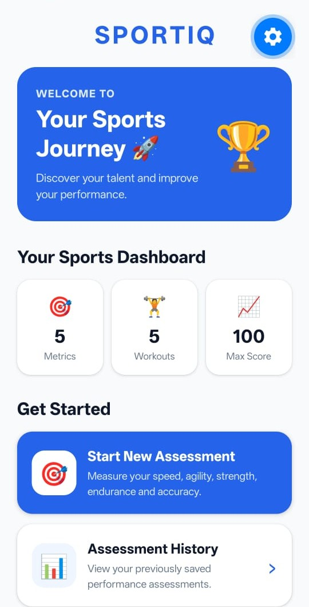
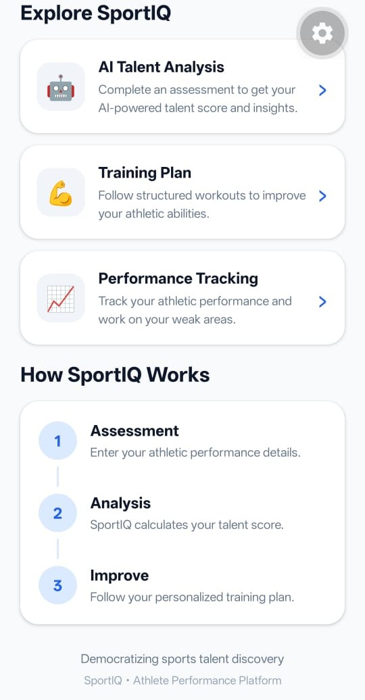
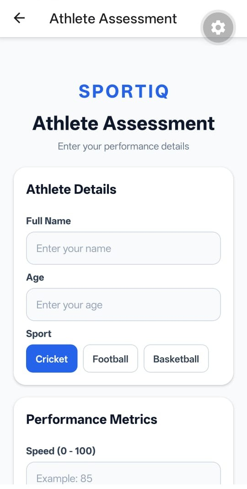
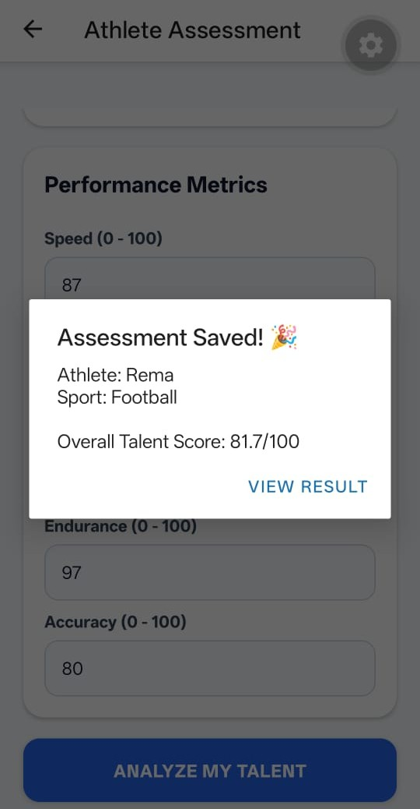
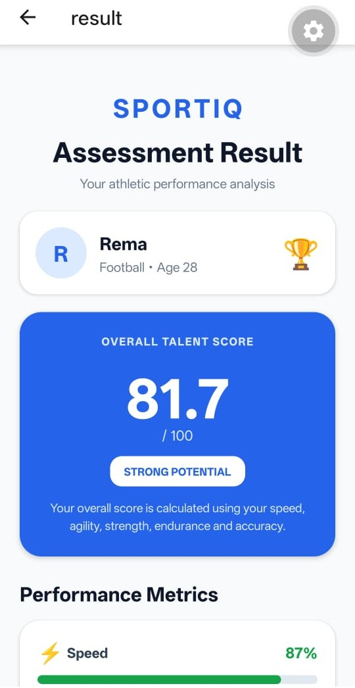
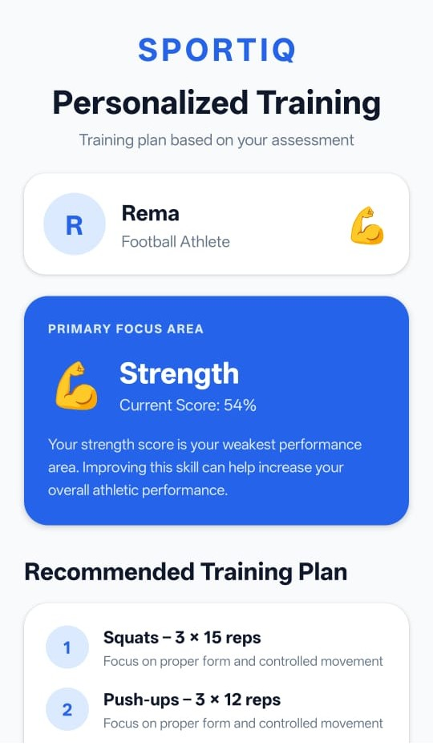
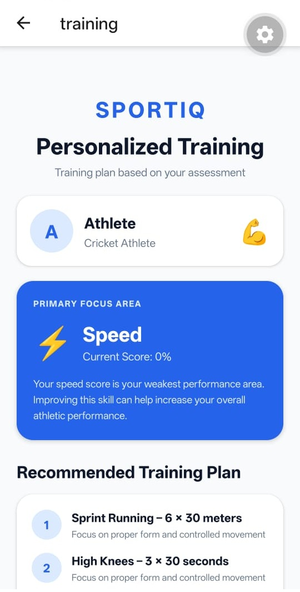

# SportIQ – Athlete Performance & Talent Analysis Platform

SportIQ is a sports performance assessment platform developed using React Native and Expo. It evaluates athletes based on multiple performance parameters and generates an overall talent score.

## Features

- Athlete Performance Assessment
- Speed, Agility, Strength, Endurance and Accuracy Analysis
- Weighted Overall Talent Score
- Performance Level Analysis
- Strongest Skill Identification
- Improvement Area Identification
- Personalized Training Plan
- Weekly Training Guide
- Assessment History
- PostgreSQL Database Integration

## Technologies Used

- React Native
- Expo
- TypeScript
- Node.js
- Express.js
- PostgreSQL
- REST API

## Performance Score Calculation

The overall talent score is calculated using weighted performance parameters:

- Speed – 20%
- Agility – 20%
- Strength – 15%
- Endurance – 20%
- Accuracy – 25%

### Formula

Score = (Speed × 0.20) + (Agility × 0.20) + (Strength × 0.15) + (Endurance × 0.20) + (Accuracy × 0.25)

## Project Flow

Home → Assessment → Score Calculation → Result → Training Plan → History

## Backend API

The backend is developed using Node.js and Express.js.

### Main API Endpoints

- POST /assessment – Save athlete assessment
- GET /athletes – Get all athlete records
- GET /assessments – Get all assessments
- GET /latest-athlete – Get latest athlete assessment

## Database

PostgreSQL is used to store athlete assessment records.

### Database Name

sportiq_db

## How to Run

### Frontend

Install dependencies:

npm install

Start the Expo application:

npx expo start

### Backend

Go to the server folder:

cd server

Install dependencies:

npm install

Start the backend:

node server.js

## Project Structure

SportIQ/
├── assets/
├── server/
│   ├── server.js
│   ├── package.json
│   └── .env
├── src/
│   ├── app/
│   ├── components/
│   ├── constants/
│   └── hooks/
├── package.json
├── app.json
└── README.md

## Screenshots

### Home Page

### Home Page 2

### Start Assessment

### Assessment Saved

### Performance Analysis

### AI Analysis

### Result

### Strength Analysis

### Training Plan

### Weekly Training Guide

## Author

Akshata Parve

## GitHub

akshataparve16/SportIQ
